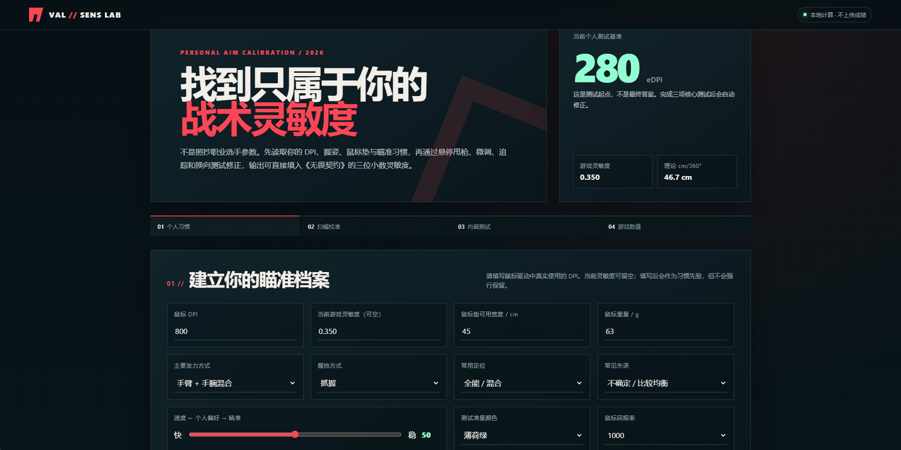
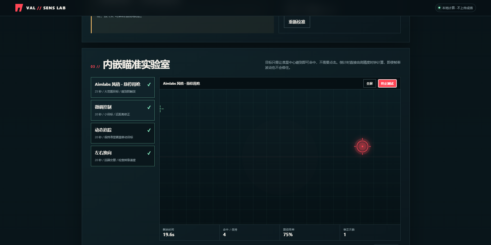
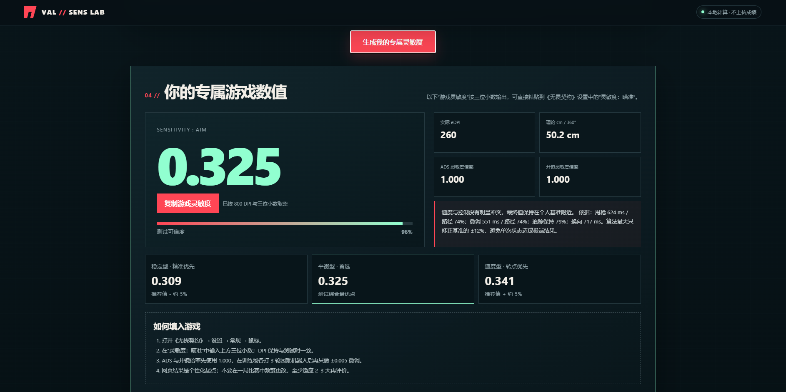

# 🎯 VALORANT Personalized Sensitivity Generator

<div align="center">

**无畏契约 / VALORANT 个性化灵敏度生成器**

通过实际瞄准测试，寻找更适合你的 VALORANT 灵敏度。

**Find the sensitivity that fits you — not everyone else.**

[🎮 在线体验 / Live Demo](https://xpc027.github.io/valorant-sensitivity-generator/) ·
[💻 Source Code](https://github.com/XPC027/valorant-sensitivity-generator) ·
[🐛 Report Bug](https://github.com/XPC027/valorant-sensitivity-generator/issues)

</div>

---

## 🚀 Online Demo / 在线体验

无需安装任何软件，直接打开网页即可使用：

### 👉 https://xpc027.github.io/valorant-sensitivity-generator/

推荐使用电脑端现代浏览器，并使用平时玩 VALORANT 时的鼠标、DPI 和桌面环境进行测试。

---

## 📸 Preview / 项目预览

### 🏠 Personalized Calibration / 个性化瞄准档案

<div align="center">
  <a href="https://xpc027.github.io/valorant-sensitivity-generator/">
    
  </a>
</div>

<p align="center">
  <b>🎮 点击图片即可在线体验 / Click the image to try it online</b>
</p>

输入 DPI、当前灵敏度、鼠标垫空间、鼠标重量、握持方式与瞄准习惯，建立个人瞄准基准。

---

### 🎯 Built-in Aim Tests / 内嵌瞄准测试

<div align="center">
  
</div>

通过 Flick、微调控制、动态追踪和左右换向等测试分析真实鼠标控制表现。

部分测试采用 **Hover to Hit** 机制，准星触碰目标即可完成命中，无需点击。

---

### 🎮 Personalized Result / 个性化灵敏度结果

<div align="center">
  
</div>

完成测试后，系统会综合测试表现生成推荐的 **VALORANT Sensitivity、eDPI 与 cm/360°**，同时提供精准型、平衡型与速度型灵敏度参考。

---

## 📖 About / 项目简介

**VALORANT Personalized Sensitivity Generator** 是一个专为《VALORANT / 无畏契约》玩家设计的个性化鼠标灵敏度测试与生成工具。

与直接复制职业选手灵敏度或随机生成数值不同，本项目通过多种交互式瞄准测试，分析玩家的：

* 🎯 Flick / 甩枪能力
* 🔬 Micro Adjustment / 微调能力
* 🎯 Tracking / 跟枪能力
* ↔️ Direction Change / 换向控制
* ⚡ Reaction / 反应速度
* 🖱️ Mouse Control / 鼠标控制
* 📊 Accuracy / 瞄准稳定性

并结合玩家的 **Mouse DPI、当前游戏灵敏度、鼠标与个人操作习惯**，综合生成更加适合个人使用的 VALORANT 推荐灵敏度。

> **本项目的目标不是寻找一个适合所有人的“完美灵敏度”，而是帮助玩家找到更适合自己的控制范围。**

---

## ✨ Features / 核心功能

* 🎯 Aim Trainer 风格交互式瞄准测试
* 🔫 Flick / 甩枪测试
* 🔬 Micro Adjustment / 微调控制测试
* 🎯 Tracking / 动态跟枪测试
* ↔️ Direction Change / 左右换向测试
* ⚡ Reaction / 反应与目标定位能力测试
* ➕ 游戏风格准星
* ⏱️ 实时测试倒计时
* 📊 测试结果统计
* 👆 部分测试支持鼠标触碰目标自动触发，无需点击
* 🧠 根据多项测试表现综合计算
* 🎮 输出可直接用于 VALORANT 的 Sensitivity
* 🖱️ 支持 DPI / Sensitivity / eDPI 计算
* 📏 提供 cm/360° 灵敏度参考
* 🌐 浏览器直接运行
* 📦 无需安装额外程序
* 🚀 支持 GitHub Pages 在线部署
* 🔒 本地计算，不上传测试成绩

---

## 🧠 How It Works / 工作原理

本项目不会简单随机生成一个所谓的“最佳灵敏度”。

整体测试流程：

```text
基础参数
   ↓
Mouse DPI / 当前 Sensitivity / 操作习惯
   ↓
Flick Test
   ↓
Micro Adjustment Test
   ↓
Tracking Test
   ↓
Direction Change Test
   ↓
综合分析测试表现
   ↓
Sensitivity Adjustment
   ↓
Recommended VALORANT Sensitivity
```

系统会根据玩家在不同测试中的表现，包括：

* 鼠标移动速度
* 路径稳定性
* 微调能力
* 大范围甩枪能力
* 目标追踪能力
* 换向控制能力
* 反应表现
* 综合操作稳定性

对初始灵敏度进行修正，最终生成个性化推荐结果。

---

## 🎮 Sensitivity Parameters / 灵敏度参数

### Sensitivity

VALORANT 游戏中的鼠标瞄准灵敏度。

生成器提供的推荐 `Sensitivity` 可以直接输入 VALORANT 游戏设置中使用。

---

### eDPI

eDPI 是综合表示鼠标 DPI 与游戏灵敏度的常用指标：

```text
eDPI = Mouse DPI × VALORANT Sensitivity
```

例如：

```text
Mouse DPI:              800
VALORANT Sensitivity:   0.300

eDPI = 800 × 0.300
     = 240
```

最终：

```text
DPI:          800
Sensitivity:  0.300
eDPI:         240
```

---

### cm/360°

`cm/360°` 表示鼠标在鼠标垫上移动多少厘米，可以让游戏视角旋转完整的 360°。

通常：

```text
Higher Sensitivity
→ Smaller cm/360°

Lower Sensitivity
→ Larger cm/360°
```

它可以帮助玩家更加直观地理解不同灵敏度之间的差异。

---

## 🚀 How to Use / 使用方法

### 方法一：在线使用

直接访问：

https://xpc027.github.io/valorant-sensitivity-generator/

按照页面提示填写参数并完成测试即可。

---

### 方法二：本地运行

Clone 项目：

```bash
git clone https://github.com/XPC027/valorant-sensitivity-generator.git
```

进入项目目录：

```bash
cd valorant-sensitivity-generator
```

然后使用现代浏览器直接打开：

```text
index.html
```

即可运行。

无需安装：

```text
Node.js
Python
npm
额外服务器
```

---

## 🎯 Recommended Testing Method / 推荐测试方式

为了获得更加稳定的推荐结果，建议：

1. 使用平时玩 VALORANT 时使用的鼠标。
2. 输入真实的 Mouse DPI。
3. 使用平时的鼠标垫和桌面空间。
4. 测试过程中不要临时修改 DPI。
5. 保持与正常游戏相近的鼠标操作方式。
6. 正常完成测试，不需要刻意追求极限速度。
7. 如果出现明显误操作，可以重新测试。
8. 尽量完成全部核心测试后再生成最终结果。
9. 获得推荐灵敏度后，先进入 VALORANT 训练场进行适应。
10. 根据实际游戏手感进行小范围微调。

> 推荐结果更适合作为一个**个性化灵敏度调整基准**，而不是不可修改的绝对数值。

---

## 🖥️ Tech Stack / 技术栈

项目主要使用：

```text
HTML5
CSS3
JavaScript
Canvas
```

当前版本采用 **Single-file Web App** 形式。

HTML、CSS 与 JavaScript 集成在：

```text
index.html
```

中。

因此无需后端服务器即可运行核心功能。

---

## 📁 Project Structure / 项目结构

```text
valorant-sensitivity-generator/
│
├── assets/
│   ├── preview-home.png
│   ├── preview-aim-test.png
│   └── preview-result.png
│
├── index.html
├── README.md
├── LICENSE
└── NOTICE
```

### `index.html`

灵敏度生成器主体，包括：

```text
User Interface
Aim Tests
Test Logic
Sensitivity Calculation
Result Display
```

### `assets/`

项目预览截图及后续静态资源。

### `README.md`

项目介绍、使用方法和开发说明。

### `LICENSE`

Apache License 2.0 完整许可证。

### `NOTICE`

项目作者、原始项目地址及 Attribution / 署名信息。

---

## 🗺️ Roadmap / 后续计划

* [ ] 增加更多 Aim Tests
* [ ] 持续优化灵敏度推荐算法
* [ ] 优化 Flick Test
* [ ] 优化 Tracking Test
* [ ] 优化 Micro Adjustment Test
* [ ] 增加多轮测试综合分析
* [ ] 增加测试历史记录
* [ ] 增加成绩趋势可视化
* [ ] 增加灵敏度推荐区间
* [ ] 增加不同灵敏度横向比较
* [ ] 增加测试结果导出
* [ ] 增加更多个性化参数
* [ ] 优化不同屏幕分辨率适配
* [ ] 持续改善 UI / UX

---

## 🤝 Contributing / 参与贡献

欢迎任何形式的合理贡献：

* ⭐ Star
* 🍴 Fork
* 🐛 Bug Report
* 💡 Feature Request
* 🔧 Pull Request
* 🎯 New Aim Tests
* 🧠 Algorithm Improvements
* 🎨 UI Improvements

如果你发现测试机制问题、Bug，或者有更好的灵敏度计算思路，欢迎提交 Issue 或 Pull Request。

### Issues

https://github.com/XPC027/valorant-sensitivity-generator/issues

---

## 👤 Author / 作者

**Original Author / 原作者：Xie Pengcheng (XPC027)**

GitHub:

https://github.com/XPC027

Original Project:

https://github.com/XPC027/valorant-sensitivity-generator

如果你 Fork、修改、分发或基于本项目创建衍生版本，请按照 Apache License 2.0 的相关要求保留适用的版权、许可证和 Attribution / NOTICE 信息。

---

## ⚠️ Disclaimer / 免责声明

本项目是一个独立开发的**非官方工具**。

本项目与以下产品或团队不存在隶属、合作、赞助或官方授权关系：

* Riot Games
* VALORANT / 无畏契约
* Aim Lab

VALORANT、Aim Lab 以及相关名称、商标和游戏资产归各自权利所有者所有。

本工具生成的灵敏度属于根据玩家测试表现计算得到的**推荐值**。

本项目不保证推荐结果：

* 适合所有玩家
* 一定提升瞄准能力
* 一定提高竞技排名
* 可以替代长期训练

玩家实际表现还可能受到以下因素影响：

```text
Mouse
DPI
Mouse Pad
Monitor
FPS
Input Latency
Network Latency
Grip
Aim Style
Training
Physical Condition
```

等多种因素影响。

---

## 📜 License

This project is licensed under the:

# Apache License 2.0

本项目采用 **Apache License 2.0** 开源协议。

你可以在 Apache License 2.0 条款允许的范围内：

* 使用本项目
* Fork 本项目
* 修改源代码
* 分发项目
* 创建衍生版本
* 用于商业用途

Copyright © 2026 **Xie Pengcheng (XPC027)**.

在重新分发本项目或创建衍生作品时，请保留适用的：

* Copyright Notice
* License Notice
* Attribution Notice
* NOTICE Information

详细许可证与 Attribution 信息请查看：

```text
LICENSE
NOTICE
```

Original Project:

https://github.com/XPC027/valorant-sensitivity-generator

---

## ⭐ Support This Project

如果这个项目对你有帮助，欢迎给项目一个：

# ⭐ Star

Repository:

https://github.com/XPC027/valorant-sensitivity-generator

Live Demo:

https://xpc027.github.io/valorant-sensitivity-generator/

你的 Star、Issue、建议与 Pull Request 都会帮助项目继续完善。

---

## 🌍 English Introduction

**VALORANT Personalized Sensitivity Generator** is a browser-based aiming assessment and mouse sensitivity recommendation tool designed for VALORANT players.

Instead of simply copying another player's sensitivity or generating a random value, the tool evaluates several aspects of actual aiming performance, including:

* Flicking
* Micro Adjustment
* Tracking
* Direction Change
* Reaction
* Mouse Control

Combined with your mouse DPI, current sensitivity and aiming habits, the system calculates personalized recommended **VALORANT Sensitivity, eDPI and cm/360°** values.

The project runs directly in a modern web browser and does not require additional software installation or a backend server.

### Philosophy

> **There is no universal perfect sensitivity.
> Find the sensitivity that fits you.**

---

<div align="center">

### 🎯 Made for players who want to understand their aim instead of simply copying someone else's sensitivity.

**Original Author: Xie Pengcheng (XPC027)**

[🎮 Live Demo](https://xpc027.github.io/valorant-sensitivity-generator/) ·
[⭐ GitHub](https://github.com/XPC027/valorant-sensitivity-generator)

</div>
